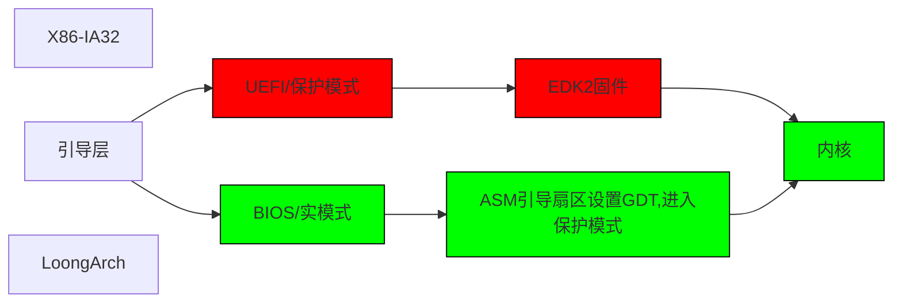

**RCOS1.0操作系统简介**
---
# 开发者
系与言
# 协作者
LeafNeko
# 项目介绍
这是我开发的第一个操作系统，名为RCOS1.0，架构有 _IA32_ 和 _LoongArch_。_X86_ 启动方式打算采取 _BIOS/UEFI_ 双启动,_LoongArch_ 用 _UEFI_。整个操作系统基本使用 _asm_ 实现。
# 项目进程
正在开发，约7~14天更新仓库
## 目前项目流程
红色代表正在进行/修改的项目，绿色代表已完成项目,蓝色代表暂缓

# 希望
大家可以能为我指出问题，联系方式见下
## 联系方式
Email: anan3055@163.com
